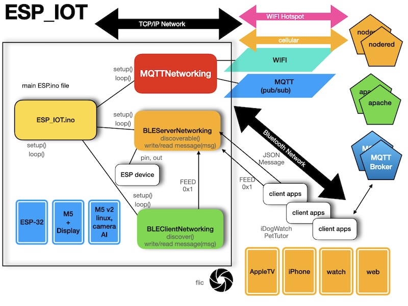
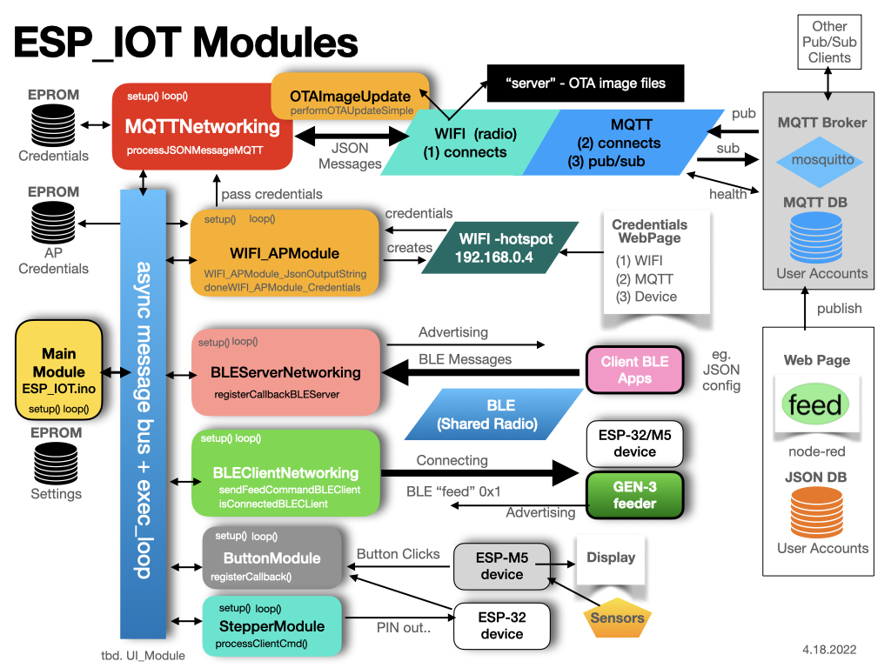
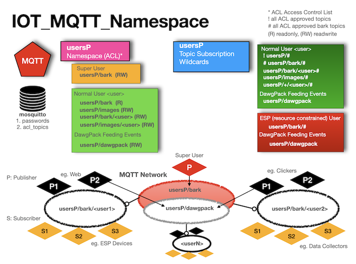
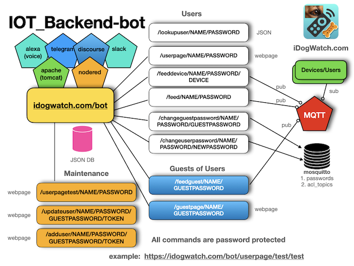

# ESP_IOT Framework v2.0

The goal of ESP_IOT is to have a set of modules that can be included in the loop and setup. Adding them will add and manipulate
various IoT capabilities, while using the ESP_IOT framework to connect the various devices. The ESP-32 devices support bluetooth and 
wifi but have a limited user interface. The M5 based ESP-32 extends with a display, speaker, temperature, axcelerometor sensers. Other devices 
such as M5 V2 incorporate a camera with machine learning functionality.

[API Manual](https://github.com/konacurrents/SemanticMarkerAPI)

[More Docs](https://github.com/konacurrents/SemanticMarkerESP-32)

When incorporated with the network through WIFI and a pub/sub engine like MQTT, using JSON formatted messages, a powerful
collaboration supports the IoT suite of applications.

The ESP_IOT supports adding and sharing between can use the #ifdef to add or remove capalities. And each has a setup() and loop() for the various functional modules. 

<a href="https://KnowledgeShark.me/docs/ESP_IOT/html">Documented Architecture and Code</a>
\ref DisplayModule
\ref MQTTModule

)



```objc
#ifdef USE_MQTT_NETWORKING
#include "src/MQTTModule/MQTTNetworking.h"
#endif

#ifdef USE_BLE_SERVER_NETWORKING
#include "src/BLEServerModule/BLEServerNetworking.h"
#endif

#ifdef USE_BLE_CLIENT_NETWORKING
#include "src/BLEClientModule/BLEClientNetworking.h"
#endif

#ifdef USE_BUTTON_MODULE
#include "src/ButtonModule/ButtonModule.h"
#endif

#ifdef USE_WIFI_AP_MODULE
#include "src/WIFI_APModule/WIFI_APModule.h"
#endif


//!functions to call, like blinkBlueLight..
void blinkBlueLight(char *message);

//! main setup of the executable
void setup()
{

#ifdef MQTTNetworking
	//register callbacks..
	//then call setup
   setupMQTTNetworking(parms..);
#endif

#ifdef BLEServerNetworking
	//register callbacks..
	//then call setup
   setupBLEServerNetworking(parms..);
#endif

#ifdef BLEClientNetworking
   //register callbacks..
   registerCallbackBLEClient(BLE_CLIENT_CALLBACK_BLINK_LIGHT, &blinkBlueLight);

   //then call setup
   setupBLEClientNetworking(parms..);
#endif
} //setup

```

And the main loop of the executable (from the Arduino runtime).

```objc
//! main loop of the executable
void loop()
{
#ifdef MQTTNetworking
   loopMQTTNetworking();
#endif

#ifdef BLEServerNetworking
   loopBLEServerNetworking();
#endif

#ifdef BLEClientNetworking
   loopBLECLientNetworking();
#endif
} //loop
```

## Mixing module functionality

The interesting part is when the modules are mixed since they perform different functions. 
One example is when a message arrives via MQTT but must be sent out on the BLE interface. 
Thus the callback on MQTT would then call one of methods in the other module. The goal
is to define generic methods that are generially called, via the the register callbacks.

## ESP32 and M5Stick

The MQTTNetwork is a capability to setup a WIFI connection and then a MQTT subscription.
Since this is for the ESP chips, the information is stored internally in the EPROM of the chip. 

# MQTTNetwork

## Header of MQTTNetwork

```objc

#define MQTTNetworking

#define MQTT_CALLBACK_FEED 0
#define MQTT_CALLBACK_BLINK 1
#define MQTT_CALLBACK_TEMP 2
//! register the callback function (with a char* message) with the callbackType (1,2,3...)
//!  eg  registerCallback(MQTT_CALLBACK_FEED, &messageFeedFunction)
void registerCallback(int callbackType, void (*callback)(char*));

//THIS IS the setup() and loop() but using the "component" name, eg MQTTNetworking()
//! called from the setup()
void setupMQTTNetworking();

//! called for the loop() of this plugin
void loopMQTTNetworking();

//!called for things like the advertisement
char *getDeviceName();

//!process the JSON message, which can be configuration information. This is called from outside on things like a Bluetooth message..
//!return true if valid JSON, and false otherwise. This looks for '{'
int processJSONMessage(char *message);

```

## Example

To use the MQTTNetwork module, the same setup and loop of the main application is used, but in that loop are calls to:
```objc
setupMQTTNetworking()

loopMQTTNetworking()
```

## Callbacks

Some operations need to be handled in the calling application, such as feeding the dog or retrieving the temperature. These are handled in callback functions. These should be called before the setup is called.
```objc

    //register the 2 callbacks for now..
    registerCallback(MQTT_CALLBACK_FEED, &feedMessageCallback);
    registerCallback(MQTT_CALLBACK_BLINK, &blinkMessageCallback);
```

These are defined as methods with a single message parameter. This message will be what was seen on the network and processed by the message process (eg. processBarkletMessage())

```objc
//!example callback: but the scope would have the pCharacteristic defined, etc..
//!This is pased just before the setupMQTTNetworking() is called..
void feedMessageCallback(char *message)
{
  SerialDebug.printf("\nNimBLE_PetTutor_Server.messageCallback: %s\n", message);
  char * rxValue = "c";  //feed

  ProcessClientCmd(rxValue[0]);   //?? client sent a command now see what it is
  // pCharacteristic->setValue(0x01);  //??  This is the acknowlege(ACK) back to client.  Later this should be contigent on a feed completed
}

//!callback for blinking led
void blinkMessageCallback(char *message)
{
    //call the already defined blink led
    BlinkLed();
}
```

## Setup via Bluetooth JSON Message

Since the device must be configured, the processJSONMesage() is called when a bluetooth message arrives (or other ways the information is gathered). This returns a boolan stating which if true means the message was processed, otherwise the caller does what it wants with the bluetooth message.

```objc
//!process the JSON message, which can be configuration information. This is called from outside on things like a Bluetooth message..
//!return true if valid JSON, and false otherwise. This looks for '{'
int processJSONMessage(char *message);
```

## JSON Format for configuring MQTT and WIFI

```json
{
  "ssid" : "SSID NAME",
  "ssidPassword" : "SSID PASSWORD`",

  "jsonHeader" : "WIFI+MQTT",
  "mqtt_server":"theMQTTServer",
  "mqtt_port":"1883",
  "mqtt_topic":"usersP/bark/test",
  "mqtt_user":"test",
  "mqtt_password":"test",
  "mqtt_guestPassword": "test"
  "deviceName": "Name of feeder",
  "name":"iDogWatch MQTT Configuration",
  "uuid":"scott",
  "mqtt_status":"Success"
}
```
## Bootstrapping by hardcoding info

In testing, or otherwise bootstrapping the device, a BOOTSTRAP ifdef is used.


```objc
#define BOOTSTRAP
#ifdef BOOTSTRAP
    //note: this could be a 'rebootstrap' message via MQTT .. in the future..
    {
        
        SerialDebug.println("BOOTSTRAP device with our own WIFI and MQTT");
        char* BOOT_mqtt_server = "idogwatch.com";
        
        char* BOOT_mqtt_port = "1883";

		  //The SSID information:
        char* BOOT_ssid = "ssidName";
        char* BOOT_ssid_password = "ssidPassword";

		  //MQTT Info
        char *BOOT_mqtt_user = "test";
        char *BOOT_mqtt_password = "test";
        char *BOOT_mqtt_topic = "usersP/bark/test";

		  //Info to name the device itself (eg. Test Feeder)
		  char *BOOT_deviceName = "Test Feeder";
        char *BOOT_uuidString = "unused";
        char *BOOT_jsonHeaderString = "WIFI+MQTT";
        char *BOOT_jsonVersionString ="BOOTSTRAP 1.1";
        
		  // store in the JSONVar .. (not shown)

        SerialDebug.print("Writing EPROM JSON = ");
        
        SerialDebug.println(myObject);
        _preferences.putString(_preferencesJSONName, myObject);
        
        // Close the Preferences
        _preferences.end();
    }
    return;
#endif //BOOTSTRAP
```

# BLEServerNetworking

## Header of BLEServerNetworking

```objc
#define BLEServerNetworking

//!defines the operations on BLE Server Networking
//!BLEServerNetworking is the "server" side of the BLE interface

//!the 'setup' for this module BLEServerNetworking. Here the service name is added (and potentially more later)
void setupBLEServerNetworking(char *serviceName, char * deviceName, char *serviceUUID, char *characteristicUUID);
#define SERVICE_UUID        "B0E6A4BF-CCCC-FFFF-330C-0000000000F0"  //Pet Tutor feeder service for feed
#define CHARACTERISTIC_UUID "B0E6A4BF-CCCC-FFFF-330C-0000000000F1"  //Pet Tutor feeder characteristic

//!the 'setup' for this module BLEServerNetworking. Here the service name is added (and potentially more later)
void loopBLEServerNetworking();

#define BLE_SERVER_CALLBACK_ONREAD 0
#define BLE_SERVER_CALLBACK_ONWRITE 1

//! register the callback function (with a char* message) with the callbackType (1,2,3...)
//!  eg  registerCallback(BLE_SERVER_CALLBACK_FEED, &messageFeedFunction)
void registerCallbackBLEServer(int callbackType, void (*callback)(char*));

//!sets the device name
void setBLEServerDeviceName(char *deviceName);

//!send something over bluetooth, this right now is 0x01 
void sendBLEMessageACKMessage();
```

## Example

To use the MQTTNetwork module, the same setup and loop of the main application is used, but in that loop are calls to:
```objc
  setupBLEServerNetworking("PTFeeder", getDeviceName(), PT_SERVICE_UUID, PT_CHARACTERISTIC_UUID);

   loopBLEServerNetworking()
```

## Callbacks

```objc

 //*** The callback for "onWrite" of the bluetooth "onWrite'
  registerCallbackBLEServer(BLE_SERVER_CALLBACK_ONWRITE, &onWriteBLEServerCallback);
```

# BLEClientNetworking

## Header of BLEClientNetworking

```objc
#define BLEClientNetworking

#define BLE_CLIENT_CALLBACK_ONREAD 0
#define BLE_CLIENT_CALLBACK_ONWRITE 1
#define BLE_CLIENT_CALLBACK_BLINK_LIGHT 2

//! register the callback function (with a char* message) with the callbackType (1,2,3...)
//!  eg  registerCallback(BLE_CLIENT_CALLBACK_FEED, &messageFeedFunction)
void registerCallbackBLEClient(int callbackType, void (*callback)(char*));

//!the 'setup' for this module BLEClientNetworking. Here the service name is added (and potentially more later)
void setupBLEClientNetworking(char *serviceName, char *serviceUUID, char *characteristicUUID);

//!the loop()
void loopBLEClientNetworking();

//FOR NOW THIS IS HERE.. but it should be more generic. eg:  sendBluetoothCommand() ..
//send the feed command
void sendFeedCommandBLEClient();

```

## Example

```objc
    registerCallbackBLEClient(BLE_CLIENT_CALLBACK_BLINK_LIGHT, &blinkBlueLight);
    setupBLEClientNetworking((char*)"PTFeeder",(char*) SERVICE_UUID, (char*) CHARACTERISTIC_UUID );

	 loopBLEClientNetworking
```
## Callbacks

```objc
    registerCallbackBLEClient(BLE_CLIENT_CALLBACK_BLINK_LIGHT, &blinkBlueLight);
```


## BNF Grammer for Barklet Language

```objc
/*
 * @discussion
 * Description = Grammer for Barklet communication
 @code
 * --- BNF: NOTE: {} are part of language not BNF
 * --NOTE: <guest ID> ":"  -- created by chat-room, not user messages
 *   message          ::= [<guest ID> ":"] <payload> <player_name> [<time>]
 *   payload          ::= <request> [<deviceInfo>] | <reply>
 *   request          ::= #STATUS | #TEMP | #CAPTURE | #FEED | #VERSION
 *   reply            ::=  <connection>
 *                       | <location>
 *                   | <biometrics> <bot_name>
 *                   | <ack>
 *                   | <chat>
 *                   | <version>
 *                   | <distanceTo< <bot_name>
 *   connection       ::= <connectionStatus> <status>
 *   connectionStatus ::= <connectionPhase> <bot_name> | #REMOTE
 *   connectionPhase  ::= #CONNECTED | #WAITING | #DISCONNECTED
 *   status           ::= {I,F,remote}   //Inside network, Foreground  || Outside, background
 *   location         ::= #GPS <loc>
 *   loc              ::= {nil} | {<lat:float>,<lon:float>,<alt-feet:float>}
 *   chat             ::= #CHAT_CONNECTED | #CHAT_DISCONNECTED
 *   ack              ::= #ACK <ack_kind>
 *   ack_kind         ::= <ack_feed>
 *   ack_feed         ::= "Fed" <bot_name>
 *   biometrics       ::= <temp> | <acceleration>
 *   temp             ::= {TempF=<float>}
 *   acceleration     ::= {Acc=<floatX>,<floatY>,<floatZ>}
 *   deviceInfo       ::= <identity> | {"deviceName":<name>}
 *   bot_name         ::= <identity>
 *   player_name      ::= <identity>
 *   identity         ::= {<name> [<UUID>]}
 *   UUID             ::= <32 bit name>
 *   float            ::= <int> : <int>
 *   time             ::= {hh:mm:ss}
 *   version          ::= {ver=x.x}
 @endcode
 */
```

## MQTT Namespace



The MQTT topic namespace architecture.

## IOT Backend



The nodered backend.

## ESP Stability

Testing as of 2.2.22 has the following observations:

1. Sending a FEED command at 5 second intervals, seems to overload the WIFI of the ESP after 12 hours. It still listens on BLE but cannot connect to WIFI. 

2. Sending FEED at 1 minute intervals results in the ESP running for much longer.

3. The MQTT backend (mosquitto) is working nicely so far. 

## MQTT Scalability

According the a 2015 benchmark, MQTT can handle 60,000 publishers running Mosquitto. 

http://www.scalagent.com/IMG/pdf/Benchmark_MQTT_servers-v1-1.pdf

## OTA Image Sizes

```
ESP-32
----
With DebugDebug
Full:                1040206 bytes (79%)
Without WIFI_AP:      75%
Without BLE_SERVER   836042  bytes (63%)
Without MQTT         1000690 bytes (76%)
Without Buttons      1039706 bytes (79%)

(basically anyone includes BLE code .. it adds 15%)

```

```
Without DebugDebug  
Full: 1030010 bytes (78%) -- 10204 less bytes
Without WIFI_AP:     979246 bytes (74%)
Without BLE_SERVER   817038 bytes (62%)
Without MQTT         994870 bytes (75%)
Without either MQTT or WIFI (<WiFi.h>): 
                     568866 bytes (43%)

```

```
ESP_M5
----
With DebugDebug  
Full:               1108922 bytes (84%) 
Without DebugDebug  
Full:               1087725 bytes (82%)
Without WIFI_AP:    1040309 bytes (79%)
Without BLE_SERVER  1082581 bytes (82%) 
Without BLE_CLIENT  1068765 bytes (81%) 
Without BLE both    843785  bytes (64%)   
Without MQTT        1051605 bytes (80%)
Without either MQTT or WIFI (<WiFi.h>): 
                    645349  bytes (49%)

```
(basically anyone includes BLE code .. it adds 20%)
## Author

konacurrents, scott@konacurrents.com

## License

KSNetworking is available GNU GENERAL PUBLIC LICENSE. See the LICENSE file for more info.

