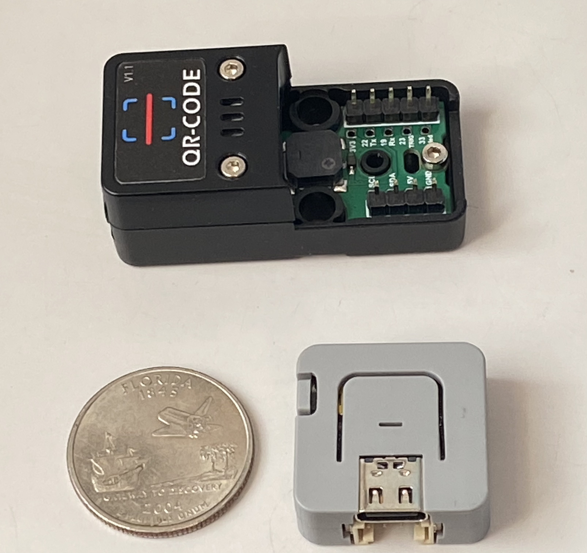
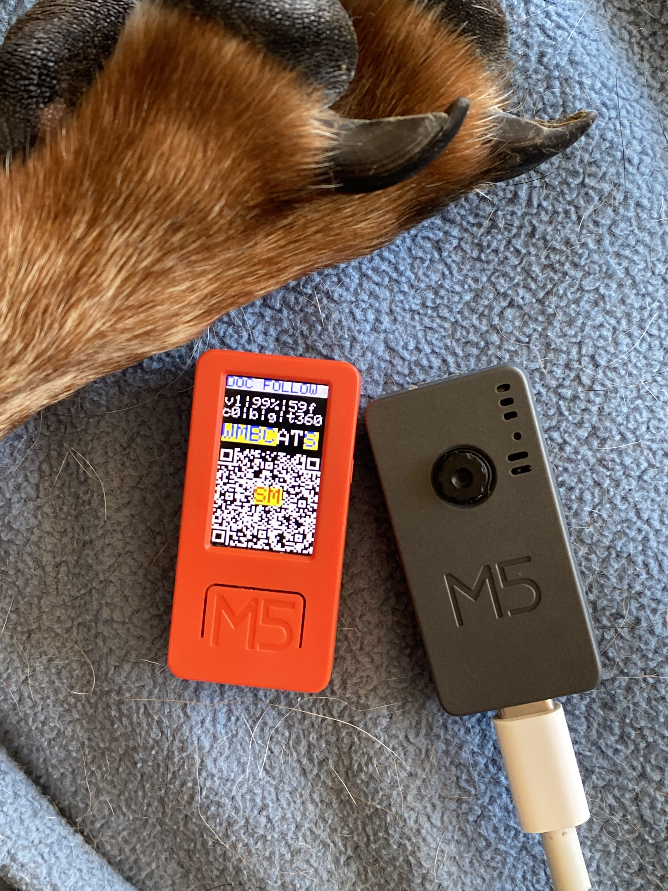
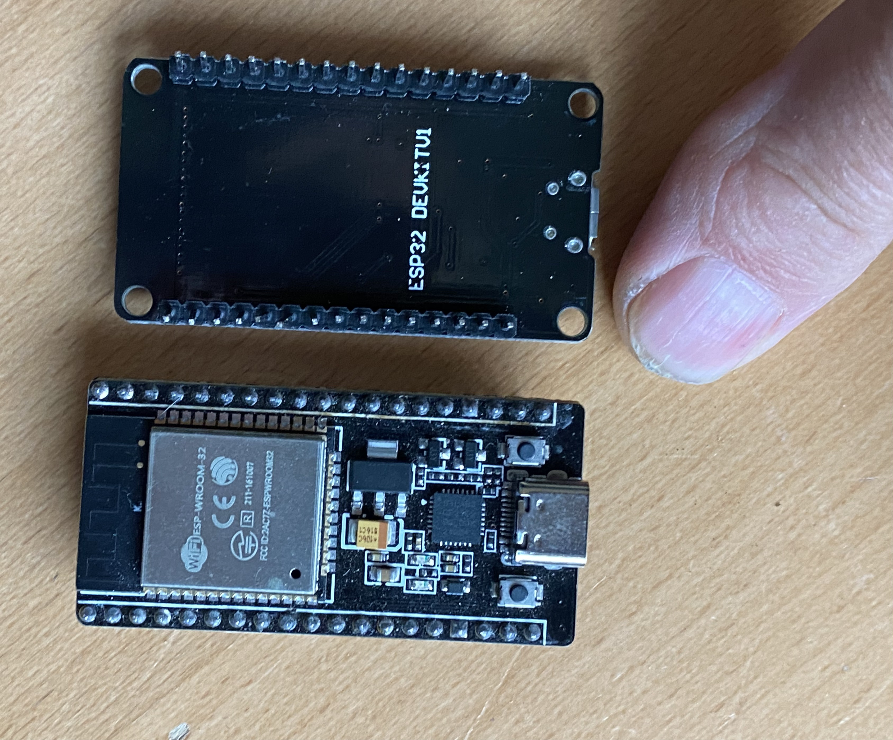
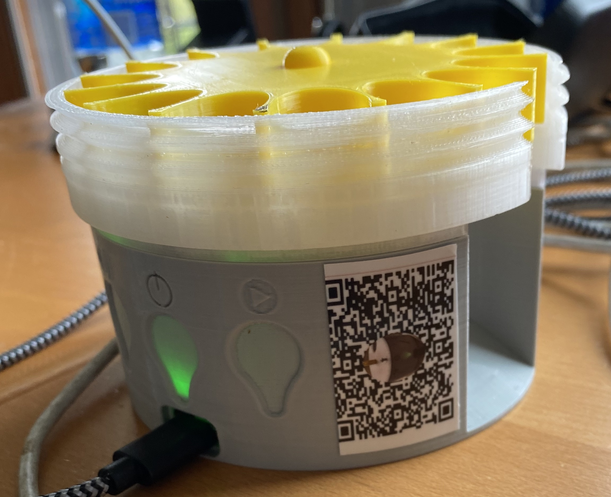
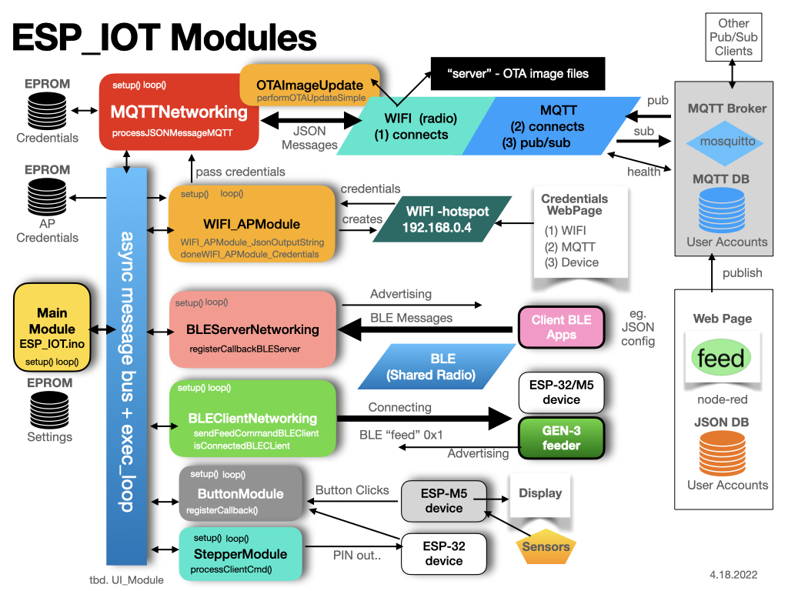

# Semantic Marker&trade; for ESP-32 IOT Framework v2.0

This repository contains the software for buliding capability for the ESP-32 set of boards, while supporting the Semantic Marker&trade; vision described at [https://SemanticMarker.org](https://SemanticMarker.org). This includes displays and internet messaging. 

To implement this vision, the Semantic Marker&trade; for ESP-32 IOT designed and implemented a generic framework for communicating with the various messaging API's [API Document](https://github.com/konacurrents/SemanticMarkerAPI).

This set of modules that can be included and invoked by the runtime kernel. 

Conditionally including them (with #ifdef statements) will add and manipulate various IoT capabilities, while using the ESP_IOT framework to connect the various devices. The ESP-32 devices support bluetooth and WIFI but have a limited user interface. The M5 based ESP-32 extends with a display, speaker, temperature, axcelerometor sensers. Other devices 
such as M5 V2 incorporate a camera with machine learning functionality.

When incorporated with the network through WIFI and a pub/sub engine like MQTT, using JSON formatted messages, a powerful
collaboration supports the IoT suite of applications.

# Building the SemanticMarkerESP executable

After cloning or downloading follow these steps.

1. The arduino runtime must be installed. For example: [ardunio-cli](https://www.arduino.cc).
2. The runtime for the M5stack is required in the <b>Additional Boards Manager URLs</b> of the <b>settings</b>
For example comma seperated json files URL's
```url
https://dl.espressif.com/dl/package_esp32_index.json
https://m5stack.oss-cn-shenzhen.aliyuncs.com/resource/arduino/package_m5stack_index.json
```
3. Set the appropriate Board (under Tools->Board). For the M5 use <b>M5Stick-C-Plus</b> and for the ESP-32 base use <b>ESP32 Dev Module</b>.

4. Modify the [Defines.h](Defines.h) to reflect the build target. For example the M5 devices ESP_M5_ATOM_LITE_QR_SCANNER_CONFIGURATION or ESP_M5_SMART_CLICKER_CONFIGURATION
5. Then build using the arduino compiler and install using the USB cable. Note, that the <b>Partition Scheme</b> should be default including OTA support.
6. Alternately, the Over the Air (OTA), can be used. Currently for this software base these are located at the [http://KnowledgeShark.org](http://KnowledgeShark.org) site. Note that this is <b>http</b> not <b>https</b> as the ESP32 devices cannot currently communicate using the secure connection.

## Build Targets

Currently there are 3 M5 builds and 1 ESP-32 base build.
This includes:
1.  <b>ESP_M5_SMART_CLICKER_CONFIGURATION</b> (M5 with a display) 

2.  <b>ESP_M5_ATOM_LITE_QR_SCANNER_CONFIGURATION</b> (M5 connected to the ATOM QR Code Scanner) 

3.  <b>ESP_M5_CAMERA</b> (M5 with a built in camera)

4.  <b>ESP_32_FEEDER</b> (a simple ESP-32 chip with the 2 lights). If this chip is connected via the PINs then
    additional configurations and code are required. These are outside the open-source aspects of this software.


# API Document

Another GitHub repository describes the API aspects of the Semantic Marker&trade; framework leveraged by the ESP-32 IoT devices.

[API Document](https://github.com/konacurrents/SemanticMarkerAPI)

# Architecture Document

Another aspect of the Semantic Marker&trade; Architecture document is included as follows:
<a href="https://KnowledgeShark.me/docs/ESP_IOT/html">Documented Architecture and Code</a>

# Semantic Marker&trade; Examples

Numerous examples are described that show the use of ESP-32/M5 IoT Devices to spport the Semantic Marker&trade; vision.

## Semantic Marker&trade; and M5 Display

The power of the small M5 display as it expands it's visual capabilities by leveraging the Semantic Marker&trade; as shown in the following diagram. Here the M5 (as built above) interacts through the MQTT messaging to perform numerous operations and acting like a display capability (by intelligent decoding of the visual Semantic Marker&trade;)


The small M5 display has been leveraged to create a small footprint of information, including using the buttons
to move around like menues. As this display is so small, the Semantic Marker&trade; is used to abstract information
into a small image - the Semantic Marker&trade; as shown here stuck to a common household microwave (the M5 has a magnet). 


Here the Semantic Marker&trade; is continually changing to reflect the sensor information. For example of the sensor information
follow this [SMART Button Sensor Status](https://semanticmarker.org/bot/status?v=v2&dev=Fibi&b=87&temp=10&c=0&t=0&W=on&M=on&A=off&T=off&S=on&bleS=PTFeeder&Z=on&G=off)
```url
https://semanticmarker.org/bot/status?v=v2&dev=Fibi&b=87&temp=10&c=0&t=0&W=on&M=on&A=off&T=off&S=on&bleS=PTFeeder&Z=on&G=off
```


## Semantic Marker&trade; in-situ and scanned by a user
Another Semantic Marker&trade; example is to send messages to a device with the embedded ESP-32 device. (This version, called a PetTutor, is from [Smart_Animal_Training](https://smartanimaltraining.com). In this example, a Semantic Marker&trade; has been printed and attached to the device. Users can then scan the Semantic Marker&trade; which will effectively connect to this device and perform the desired operation.


A nice short clip that shows this scanning in action is at: [M5 in action video](https://semanticmarker.org/vision/AR_SM.mov)

# Semantic Marker&trade; Architecture Documents

The Networking architecture is shown here:


The complexity of the ESP-IOT framework is shown here:


# Networking with the Semantic Marker REST API and Messaging Capabilities


------------------------------------------------------------------------------------------
# Messaging BNF Grammar 

These are the Websocket and MQTT messaging formats. This includes the legacy websocket interface
defined as the <b>Barklet Language</b>. The format is a mix of original Barklet Language used with WebSockets,
and the newer JSON Format messages.

Many of the messages described in the following BNF Grammar can be run
through the shell commands described in the API manual: [SemanticMarkerAPI Manual](https://github.com/konacurrents/SemanticMarkerAPI).
To run, download the scripts and run with a valid username and password.

## BNF Grammar for Barklet Language

```ebnf
  Description ::= Grammar for Barklet communication
   NOTE ::= {} are part of language not BNF
   NOTE ::= : <guest ID> ":"  created by chat-room, not user messages

    message          ::= [<guest ID> ":"] <payload> <player_name> [<time>] 
                    | '{' [<device>] <JSONMessage> '}'
    payload          ::= <request> [<deviceInfo>] [<SemanticMarker>] [<OTA>]| <reply>
    request          ::= #STATUS | #TEMP | #CAPTURE | #FEED 
	                 | #VERSION | #DOCFOLLOW | #followMe | #CLEAN_SSID_EPROM | #OTA
    reply            ::=  <connection>
                        | <location>
                    | <biometrics> <bot_name>
                    | <ack>
                    | <chat>
                    | <version>
                    | <distanceTo< <bot_name>
    SemanticMarker   ::= AVM= <SMAddress>
    SMAddress        ::= SemanticMarkerURL
    OTA              ::= {v=Version} | {k=<kind>}
    kind             ::= ESP_M5 | ESP_32
    connection       ::= <connectionStatus> <status>
    connectionStatus ::= <connectionPhase> <bot_name> | #REMOTE
    connectionPhase  ::= #CONNECTED | #WAITING | #DISCONNECTED
    status           ::= {I,F,remote}   //Inside network, Foreground  || Outside, background
    location         ::= #GPS <loc>
    loc              ::= {nil} | {<lat:float>,<lon:float>,<alt-feet:float>}
    chat             ::= #CHAT_CONNECTED | #CHAT_DISCONNECTED
    ack              ::= #ACK <ack_kind>
    ack_kind         ::= <ack_feed> | <docfollow>
    ack_feed         ::= "Fed" <bot_name>
    biometrics       ::= <temp> | <acceleration>
    temp             ::= {TempF=<float>}
    acceleration     ::= {Acc=<floatX>,<floatY>,<floatZ>}
    deviceInfo       ::= <identity> | {"deviceName":<name>}
    bot_name         ::= <identity>
    player_name      ::= <identity>
    identity         ::= {<name> [<UUID>]}
    UUID             ::= <32 bit name>
    float            ::= <int> : <int>
    time             ::= {hh:mm:ss}
    version          ::= {ver=x.x}
    number           ::= <int>
    boolean          ::= "on" | "off"
 
    JSONMessage      ::= <set> | <setdevice> | <send> | <set64> | <SemanticMarkerApp Messages>
    device           ::= "device" : name_of_device
    setdevice        ::= <device> <set>
    set              ::= "set" : setString , "val": valString
    send             ::= "send" : sendString
    set64            ::= "set64" : <encodedBase64String>
    setString        ::= "semanticMarker" 
                      | "highTemp" <number>
                      | "feed" <boolean>
                      | "status" <boolean>
                      | "resetTimer" <boolean>
                      | "devOnlySM" <boolean>
                      | "ble+wifi" <boolean>
                      | "factoryReset" <boolean>
                      | "restartModels" <boolean>
                      | "screenTimeout" <number>
                      | "stepperAngle" <number>
                      | "noclick"  <boolean>
                      | "gateway"  <boolean>
                      | "DiscoverM5PTClicker"  <boolean>
                      | "useSPIFF"  <boolean>
                      | "timerDelay" <number>
                      | "startTimer"  <boolean>
                      | "stepper"  <number>
                      | "clockWiseMotor" <boolean>
                      | "otaFile" <string>
                      | "location" <string>
                      | "device"  <string>
                      | "pairNow"  <boolean>
                      | "pairDev" <string>
                      | "useGroups" <boolean>
                      | "groups" <boolean>
                      | "screenColor" <number>
                      | "gen3only" <boolean>
                      | "BLEUsePairedDeviceName" <boolean>
                      | "BLEUseDeviceName" <boolean>
                      | "minMenue" <boolean>
                      | "addWIFI" <boolean>
                      | "useDOCFOLLOW" <boolean>
                      | "semanticMarker" 
                      | "blankscreen" <boolean>
                      | "SubDawgpack" <boolean>
                      | "buzz" <boolean>
                      | "BLEClient" <boolean>
                      | "BLEServer" <boolean>
                      | "tilt" <boolean>
                      | "zoomSM" <SMNum>
                      | "buttonA" ["longpress" | "shortpress"]
                      | "buttonB" ["longpress" | "shortpress"]

    sendString      ::= "temp" 
                      | "status" 
                      | "capture" 
                      | "volume" 
                      | "feed" 

    encodedBase64String ::=
                      |  <Semantic Marker value after decoding base64>

    SemanticMarkerAppMessages ::=
                      | DEBUG <boolean>
                      | HUD <boolean>
                      | MQTT_DEBUG <boolean>
                      | SMFocusCapture <boolean>
                      | SMSharing <boolean>
                      | SMSharingLeader <boolean>
                      | SM_AR_Minimal <boolean>
                      | SM_AR_ZOOM <boolean>
                      | SM_AR_Zoom <boolean>
                      | SM_Flip <boolean>
                      | SM_FlipRotate <boolean>
                      | SM_Instance_Image <boolean>
                      | SM_QRAvatar <boolean>
                      | SM_ReplaceUUID <boolean>
                      | SM_UseCropImage <boolean>
                      | SM_VisionLinker <boolean>
                      | animals <boolean>
                      | images <boolean>
                      | matrix <boolean>
                      | noclick <boolean>
                      | pause <boolean>
                      | pdf <boolean>
                      | replaceUUID <UUID string>
```

------------------------------------------------------------------------------------------

# Module design
While not going into detail on it's capabilities, the following short description shows how the build can be 
configured through the use of conditional module compiling.

To optionally include specific code, the various MODULE are included in a scheme like the following:

```c
#ifdef USE_MQTT_NETWORKING
#include "src/MQTTModule/MQTTNetworking.h"
#endif

#ifdef USE_BLE_SERVER_NETWORKING
#include "src/BLEServerModule/BLEServerNetworking.h"
#endif

#ifdef USE_BLE_CLIENT_NETWORKING
#include "src/BLEClientModule/BLEClientNetworking.h"
#endif

#ifdef USE_BUTTON_MODULE
#include "src/ButtonModule/ButtonModule.h"
#endif

#ifdef USE_WIFI_AP_MODULE
#include "src/WIFI_APModule/WIFI_APModule.h"
#endif


//!functions to call, like blinkBlueLight..
void blinkBlueLight(char *message);

//! main setup of the executable
void setup()
{

#ifdef MQTTNetworking
	//register callbacks..
	//then call setup
   setupMQTTNetworking(parms..);
#endif

#ifdef BLEServerNetworking
	//register callbacks..
	//then call setup
   setupBLEServerNetworking(parms..);
#endif

#ifdef BLEClientNetworking
   //register callbacks..
   registerCallbackBLEClient(BLE_CLIENT_CALLBACK_BLINK_LIGHT, &blinkBlueLight);

   //then call setup
   setupBLEClientNetworking(parms..);
#endif
} //setup

```

And the main loop of the executable (from the Arduino runtime).

```objc
//! main loop of the executable
void loop()
{
#ifdef MQTTNetworking
   loopMQTTNetworking();
#endif

#ifdef BLEServerNetworking
   loopBLEServerNetworking();
#endif

#ifdef BLEClientNetworking
   loopBLECLientNetworking();
#endif
} //loop
```

------------------------------------------------------------------------------------------
## Mixing module functionality

The interesting part is when the modules are mixed since they perform different functions. 
One example is when a message arrives via MQTT but must be sent out on the BLE interface. 
Thus the callback on MQTT would then call one of methods in the other module. The goal
is to define generic methods that are generially called, via the the register callbacks.

## ESP32 and M5Stick

The MQTTNetwork is a capability to setup a WIFI connection and then a MQTT subscription.
Since this is for the ESP chips, the information is stored internally in the EPROM of the chip. 

# MQTTNetwork

## Header of MQTTNetwork

```objc

#define MQTTNetworking

#define MQTT_CALLBACK_FEED 0
#define MQTT_CALLBACK_BLINK 1
#define MQTT_CALLBACK_TEMP 2
//! register the callback function (with a char* message) with the callbackType (1,2,3...)
//!  eg  registerCallback(MQTT_CALLBACK_FEED, &messageFeedFunction)
void registerCallback(int callbackType, void (*callback)(char*));

//THIS IS the setup() and loop() but using the "component" name, eg MQTTNetworking()
//! called from the setup()
void setupMQTTNetworking();

//! called for the loop() of this plugin
void loopMQTTNetworking();

//!called for things like the advertisement
char *getDeviceName();

//!process the JSON message, which can be configuration information. This is called from outside on things like a Bluetooth message..
//!return true if valid JSON, and false otherwise. This looks for '{'
int processJSONMessage(char *message);

```

## Example

To use the MQTTNetwork module, the same setup and loop of the main application is used, but in that loop are calls to:
```objc
setupMQTTNetworking()

loopMQTTNetworking()
```

## Callbacks

Some operations need to be handled in the calling application, such as feeding the dog or retrieving the temperature. These are handled in callback functions. These should be called before the setup is called.
```objc

    //register the 2 callbacks for now..
    registerCallback(MQTT_CALLBACK_FEED, &feedMessageCallback);
    registerCallback(MQTT_CALLBACK_BLINK, &blinkMessageCallback);
```

These are defined as methods with a single message parameter. This message will be what was seen on the network and processed by the message process (eg. processBarkletMessage())

```objc
//!example callback: but the scope would have the pCharacteristic defined, etc..
//!This is pased just before the setupMQTTNetworking() is called..
void feedMessageCallback(char *message)
{
  SerialDebug.printf("\nNimBLE_PetTutor_Server.messageCallback: %s\n", message);
  char * rxValue = "c";  //feed

  ProcessClientCmd(rxValue[0]);   //?? client sent a command now see what it is
  // pCharacteristic->setValue(0x01);  //??  This is the acknowlege(ACK) back to client.  Later this should be contigent on a feed completed
}

//!callback for blinking led
void blinkMessageCallback(char *message)
{
    //call the already defined blink led
    BlinkLed();
}
```

## Setup via Bluetooth JSON Message

Since the device must be configured, the processJSONMesage() is called when a bluetooth message arrives (or other ways the information is gathered). This returns a boolan stating which if true means the message was processed, otherwise the caller does what it wants with the bluetooth message.

```objc
//!process the JSON message, which can be configuration information. This is called from outside on things like a Bluetooth message..
//!return true if valid JSON, and false otherwise. This looks for '{'
int processJSONMessage(char *message);
```

## JSON Format for configuring MQTT and WIFI

```json
{
  "ssid" : "SSID NAME",
  "ssidPassword" : "SSID PASSWORD`",

  "jsonHeader" : "WIFI+MQTT",
  "mqtt_server":"theMQTTServer",
  "mqtt_port":"1883",
  "mqtt_topic":"userP/bark/test",
  "mqtt_user":"test",
  "mqtt_password":"password",
  "mqtt_guestPassword": "password"
  "deviceName": "Name of feeder",
  "name":"iDogWatch MQTT Configuration",
  "uuid":"scott",
  "mqtt_status":"Success"
}
```


# BLEServerNetworking

## Header of BLEServerNetworking

```c
#define BLEServerNetworking

//!defines the operations on BLE Server Networking
//!BLEServerNetworking is the "server" side of the BLE interface

//!the 'setup' for this module BLEServerNetworking. Here the service name is added (and potentially more later)
void setupBLEServerNetworking(char *serviceName, char * deviceName, char *serviceUUID, char *characteristicUUID);
#define SERVICE_UUID        "B0E6A4BF-CCCC-FFFF-330C-0000000000F0"  //Pet Tutor feeder service for feed
#define CHARACTERISTIC_UUID "B0E6A4BF-CCCC-FFFF-330C-0000000000F1"  //Pet Tutor feeder characteristic

//!the 'setup' for this module BLEServerNetworking. Here the service name is added (and potentially more later)
void loopBLEServerNetworking();

#define BLE_SERVER_CALLBACK_ONREAD 0
#define BLE_SERVER_CALLBACK_ONWRITE 1

//! register the callback function (with a char* message) with the callbackType (1,2,3...)
//!  eg  registerCallback(BLE_SERVER_CALLBACK_FEED, &messageFeedFunction)
void registerCallbackBLEServer(int callbackType, void (*callback)(char*));

//!sets the device name
void setBLEServerDeviceName(char *deviceName);

//!send something over bluetooth, this right now is 0x01 
void sendBLEMessageACKMessage();
```

## Example

To use the MQTTNetwork module, the same setup and loop of the main application is used, but in that loop are calls to:
```c
  setupBLEServerNetworking("PTFeeder", getDeviceName(), PT_SERVICE_UUID, PT_CHARACTERISTIC_UUID);

   loopBLEServerNetworking()
```

## Callbacks

```c

 //*** The callback for "onWrite" of the bluetooth "onWrite'
  registerCallbackBLEServer(BLE_SERVER_CALLBACK_ONWRITE, &onWriteBLEServerCallback);
```

# BLEClientNetworking

## Header of BLEClientNetworking

```c
#define BLEClientNetworking

#define BLE_CLIENT_CALLBACK_ONREAD 0
#define BLE_CLIENT_CALLBACK_ONWRITE 1
#define BLE_CLIENT_CALLBACK_BLINK_LIGHT 2

//! register the callback function (with a char* message) with the callbackType (1,2,3...)
//!  eg  registerCallback(BLE_CLIENT_CALLBACK_FEED, &messageFeedFunction)
void registerCallbackBLEClient(int callbackType, void (*callback)(char*));

//!the 'setup' for this module BLEClientNetworking. Here the service name is added (and potentially more later)
void setupBLEClientNetworking(char *serviceName, char *serviceUUID, char *characteristicUUID);

//!the loop()
void loopBLEClientNetworking();

//FOR NOW THIS IS HERE.. but it should be more generic. eg:  sendBluetoothCommand() ..
//send the feed command
void sendFeedCommandBLEClient();

```

## Example

```objc
    registerCallbackBLEClient(BLE_CLIENT_CALLBACK_BLINK_LIGHT, &blinkBlueLight);
    setupBLEClientNetworking((char*)"PTFeeder",(char*) SERVICE_UUID, (char*) CHARACTERISTIC_UUID );

	 loopBLEClientNetworking
```
## Callbacks

```c
    registerCallbackBLEClient(BLE_CLIENT_CALLBACK_BLINK_LIGHT, &blinkBlueLight);
```


## Author

konacurrents, scott@konacurrents.com

## License

KSNetworking is available MIT PUBLIC LICENSE. See the LICENSE file for more info.

