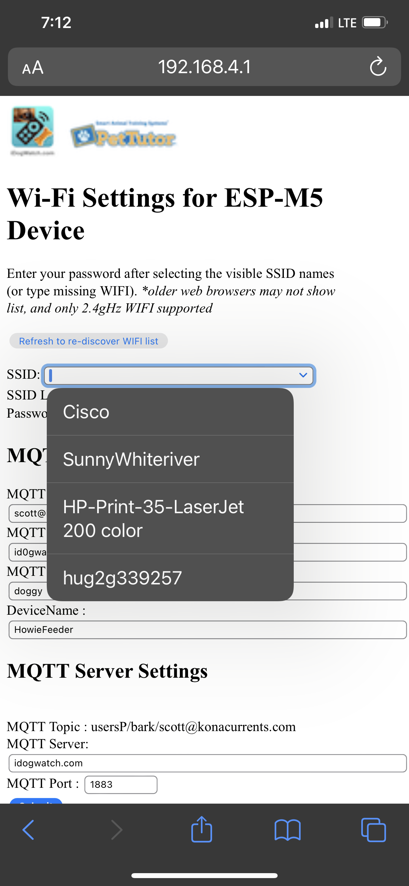

\page WIFI_AP_README

# AP Webserver 192.168.4.1

This starts a webserver at 192.168.4.1
and it's own WIFI hotspot called M5STICK_SETUP
once connected, the and viewing that web page, the user can enter the WIFI hotspot data.

Once entered, it reboots, and goes on it's way using the WIFI specified (eg. SunnyWhiteriver) and password.
This then offers a web page:  192.168.0.57
that lets others connect and modify parameters (such as the MQTT info).

The user can also connect to a web server to retrieve the approved MQTT info.

eg:   idogwatch.com/red/userinfo:USER_TAG
      idogwatch.com/red/guestuserinfo:GUEST_USER_TAG

So this would call with appropriate USER_TAG, and return with default info (eg. host, port, user, password)

Note: here is where a GUEST_USER_TAG would let a gues get the appropriate information (guest_user, guest_password)

